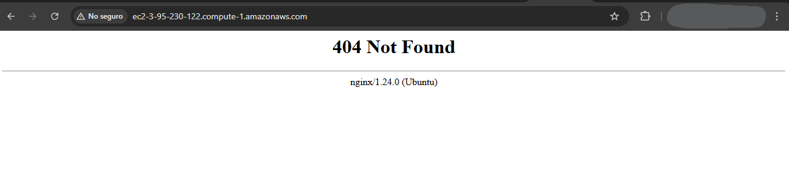
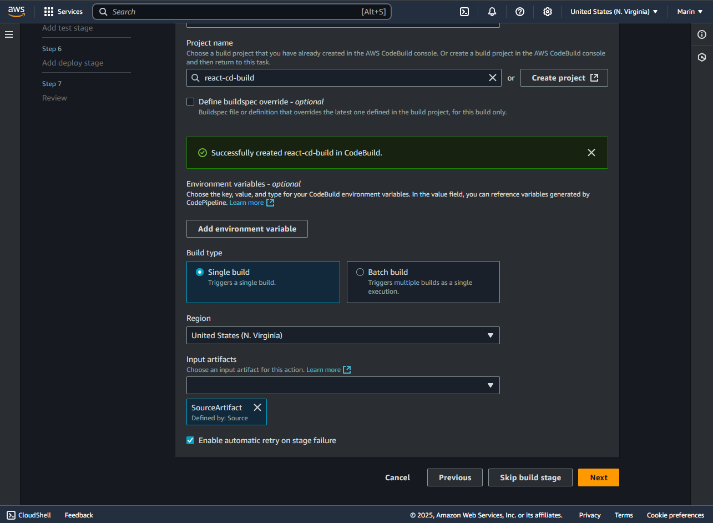

# Continuous Deployment System.

In this assigment I setup a Continuous Deployment pipeline using AWS Code Pipeline and AWS Code Build to upload a small React project to an AWS EC2 instance.

This helped me solidify my understanding of CI/CD Workflows and cloud services.

# Requirements
- AWS Account.

# Setup
Below I'll be listing how to setup the project.

# Setup a Git Repository
First let's start from a Git Repository, you can also use AWS Code Commit.

Setup a Git Repository and upload some project, preferably something using Node so its simple but also can be 'built' for deployent, this way we have the full experience going on in our CD Pipeline.


# Setup a Simple Project
For this project I developd a simple React app that shows the books I'm currently reading, you can find this code under `/frontend`.

Here is a screenshoot of it running locally.


This is going to be the initial state of the project, later once the CD Pipeline is setup I'll be adding more books to see if our Pipeline works.

Now that both the Repository and the Project are ready, we can continue to setup our Pipeline.

# Setup the EC2 Instance
We will be deploying our basic app to an EC2 instance after the build process, so lets setup our EC2 first for later attach it to our pipeline.

To do this in your AWS Dashboard go to `EC2` then `Launch Instance`

In the Launch Instance Screen add a name to your EC2 Instance.

For the OS Image select either Amazon Linux or Ubuntu. *(Here I used Ubuntu)*


Due to this instance only objective is provide us with the frontend, select a small instance like a `t2.micro`. *(Free Eligieble)**


Then generate an Access Key of type `RSA` in `.PPK` format, we will be using them for accessing our machine if needed.


Now lets finish this by seting up Network Settings.

Here make sure to enable `SSH Trafic` from Anywhere.

And setup the least ammount of storage (8GB), this is more than enough for this project.


Once setup, click on `Launch Instance`

## Configure the EC2 Instance.
Now that our EC2 instance is live, we need to setup some things inside the server to allow for it to serve as our Web Server.

Make sure the EC2 Instance is up and running and then look for its `Public DNS` by clicking on the Instance inside the EC2 Dashboard.

Then use some app like PuTTY to connect through SSL.

Remember that for Ubuntu instances you should be accessing it adding an `ubuntu@` before the DNS URL, and also add the `PPK` key under `Connection > SSH > Auth > Credentials`


Once inside our EC2 instance we will be running some commands to prepare it as a web server.


### Prepare EC2 Instance.
For this EC2 we will be using `nginx` as our web server, to install in in the EC2 run the following commands in the EC2 terminal:

```BASH
sudo apt update
sudo apt install -y nginx
sudo systemctl start nginx
sudo systemctl enable nginx
```

After running these commands we should be able to see that `nginx` service is Active.


### Setup NGINX
Now we will need to add some configuration to our NGINX service so it knows where to look for our react project.

So lets create a special folder for where to put our pipeline build.

This creates a folder three finishing in /libraryApp where our build will reside.

Then it changes the access to the current user ubuntu, which is the default user for all EC2 Ubuntu instances.

```BASH
sudo mkdir -p /var/www/html/libraryApp
sudo chown -R ubuntu:ubuntu /var/www/html/libraryApp 
```

So now we will be setting up NGINX to look for our app inside these new directories.

```BASH
sudo nano /etc/nginx/sites-available/default
```

Once inside this file we will be editing it to add the following lines:
```BASH
    root /var/www/html/libraryApp;
    index index.html;

    location / {
        try_files $uri /index.html;
    }
```

This tells NGIX to look for the index inside the folder we created, then we need to make sure that our Deployment phase copies the build content inside that folder.

*Note that these settings are already in the file, you migh need to look for them.*


Save the file by clicking `CTRL + X` then pressing `Y` and then enter.

Now we need to check if the NGINX file syntax is valid and then we will reload the process so the changes apply, to do this, run these commands:

```BASH
sudo nginx -t
sudo systemctl reload nginx
```


Now our EC2 is ready to host our React App, but we need to make sure our Code Deploy pushes the build files inside /libraryApp.

### Allow HTTP access
Now that our web server is setup, we need to allow access to our EC2 by using the port 80.

To do so, go into the `EC2` instances and check which security group is attached to the EC2 machine we are using.

In this case is `launch-wizard-1`


Then go to `Security Group` under Network & Security and then click in the security group attached to our EC2 and then click on `Edit Inbound Rules`

Here we will be selecting type `HTTP`, make sure the access is to everyone (0.0.0.0/0)


Now if we try to reach our EC2 in our browser we will get a `404 Not Found`, but this is all right, it means that we can acces to our EC2 http server, but because there is no app yet, it returns the fallback 404.



Now our EC2 is completely ready to host and provide our web app, now we need to add our web app build, this is going to be achieved using our pipeline.

# Setup Code Pipeline
Now that our Repository and EC2 is ready we will be setting up the AWS CodePipeline to fetch the code from the repository, build it and then push the build result to our EC2 server.

To achieve this go to `CodePipeline` in your AWS Dashboard and then click on `Create Pipeline`

Now in the Step 1 we will be selecting `Build Custom Pipeline`


Now in Step 2: 
- Create a name for the pipeline.
- Select `quequed` in Execution Mode.
- Let AWS Create a new Service Role.

This will help us later in granting permissions, or you can attach yours if you already have roles and permissions.


On Step 3 we wwill be connecting our repository to the Pipeline, here select the `Source Provider` as Github or CodeCommit, depending on where you setup the repository.

Then make sure to select the correct repository and the branch where the project is going to be.


Now in step 4 we will be taking another direction a bit to setup a AWS Code Build Project, in there we will be defining the rules as to how to deploy our app.

Here click `Create Project`


## Creating AWS Code Build
Now in the new window that should have pop out, we will be setting up the Code Build to specifically setup how we want our project to be built.

Here select a name for the code build and leave everything default.


Make sure you have these settings in your enviroment.

Also make sure to let AWS create a new service role, we will be needing that to grant some access later.


Here in `Buildspec` select `Use Buildspec File`


The buildspec file is a .yml file that contains all the definition as to how to build our app.

`Create a buildspec.yml` in your root of your repo and add the following settings:

Make sure this file is in the root of the repository.
```YML
version: 0.2

phases:
  install:
    runtime-versions:
      nodejs: 18
    commands:
      - cd frontend
      - npm install
  build:
    commands:
      - npm run build
  post_build:
    commands:
      - echo "Build completed on `date`"
      - mkdir -p /tmp/deploy
      - cp -r build/* /tmp/deploy/

artifacts:
  files:
    - '**/*'
  base-directory: /tmp/deploy
```

Skimming through this config you can see that, this process will get the files from `/frontend` on our repo and run npm install, to get all dependencies.

Then it will `npm run build` to create a build package of our app.

Then it will create a temp folder `/tmp/deploy` and inside of it copies all files inside of /build (the one created by npm build)

And then, exposes those files to the next stage as the artifact of this build.

Leave `Cloud Watch Logs` on for debugging if needed, and then go ahead and click `Continue to Code Pipeline`

This take us back to our step 4, here we see that the build project gets attached to our Pipeline.


In this same step, make sure you have `Input Artifact` set as Defined by: Source (Meaning our Repository).


In the next step we have Test stage, we will be skiping this because we have nothing much to test here, go ahead an click `Skip Test Stage`.


Now we will be setting up our Deployment stage, due to our current configuration and for simplicity, we will be adding an EC2 instance directly for deployment.

Select EC2 as the `Provider`

And make sure the `Input Artifacts` are defined by Build.


Then down below select EC2 as `Instance Type`, then select the EC2 we created earlier usin the key/value marked below. (This is a default tag, we can create a different one if we need/want), but using the value we make sure we select the one we want.

Then in `Deploy Specification` select `Use DeploySpec file`, this is going to be a file that the Deploy Step is going to use to know where to deploy the files.

Inside the `DeploySpec` input put `appspec.yml`, this is the name of the file this stage will look for.


Now that we selected DeploySpec file, we need to create this file in our root folder in the repo, this way we make sure the Build Phase has access to it and it passes it to the Deploy Phase.

Go to your repository and in the `ROOT` folder create a file called `appspec.yml` and paste the following code:
```YML
version: 0.0
os: linux
files:
  - source: /
    destination: /var/www/html/libraryApp
    overwrite: true
```

This simple command tells the Deploy stage to put the built result in `/var/www/html/libraryApp` (Where NGIGX expects the app to be).

Make sure to include this file in the repository.

